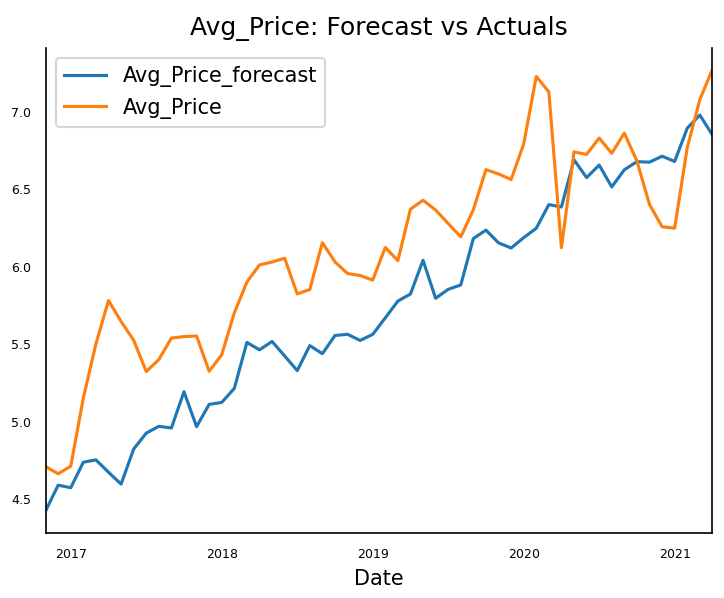

# Data-Analytics-Boot-Camp---Final-Project
Group #9 - Yining Wang, Changsong Yang, Ziqin Zhu, Xinpei Wang

# Project Overview and Selection
Through evaluating different project topics by complexity, feasibility to complete and accessibility of data source, group #9 decides to choose real estate condo sale pricing prediction within the Toronto area as the focus for this project. 

## Scope
Predict the Condo sale pricing increase/decrease (%) in the Toronto area using a rolling window (time range for the window TBD).

## Reason
Real estate can be considered as a stable and beneficial investment option for the public but the current market lacks a reliable tool to make proper predictions of Condo Sale in the Toronto area.

## Data Source
1. Historic condo sale pricing data  
- Market Watch Report in GTA  
- MLS listing  
2. Potential Impact Factors (at least past 3 years)    
- Immigration in the Toronto area  
- Population in the Toronto area  
- New students offered in Toronto universities  
- Employment rate in Toronto area
- Bank prime interest rate  
- Average age and distribution in Toronto area  
- Average personal income in Toronto area
- Government policy / subsidies (related to real estate)  
- Construction material (steel, aluminum, concrete, wood, ...) pricing  
- Public reaction to real estate topics on social media (e.g. Twitter)  
- Number of temporary workers in the Toronto area  
- Number of job postings / vacancies in the labour market  
- Stock Market Index (e.g. NASDAQ)  
- Value of American dollars  
- Value of commodity (e.g. gold)  
- Rate of Canadian currency to American currency  
- Property tax in Toronto area  
- Personal income tax in Ontario  
- (optional) Condo management fee in Toronto area   
- Number of construction plan/building proposed  
- Mortgage loan  
- Active listing of Condo unit sale on the market  
- Infrastructure (e.g. transportation, bank, supermarket)  
- Crime rate in Toronto Area  

## Data Collection and Processing
1. For non-tabular data, web-scrapping and API will be used to collect the data from online sources and then save it into JSON format. Such JSON data will be converted to tabular form.  
2. For special format data (e.g. in PDF file format), specific processing methods (i.e. PDF scrapping) will be used to extract and convert such data into tabular form accordingly.  
3. For tabular data, the Python Pandas library will be used for processing, cleaning and filtering.  
4. Post-processed data will then be saved and uploaded to AWS S3 to be accessed by all team members.   

## Machine Learning
The data processed in the previous step will be split into training and testing data for model training. A deep learning model (Long Short Term Model) will be deployed to fit the training data and make sale price predictions. The testing data will be used to validate the model and deteremine further improvement.  

## Visualization
A web is planned to provide interactive visualization to users. Such web will show the geographic appearance of the Toronto Area (MapBox) with the options for users to explore different districts in this area. Moreover, pop-up messages will be created for users to gain detailed information including the current condo selling situation in the Toronto area as well as the predictions for the future. To better provide a visual experience, Plotly will be used to generate line diagrams of sale information to provide basic trending. If time allows, more detailed analysis will be conducted for each district in Toronto so that users will be able to gain more comprehensive results of Condo sale pricing in the Toronto area.

## Results

